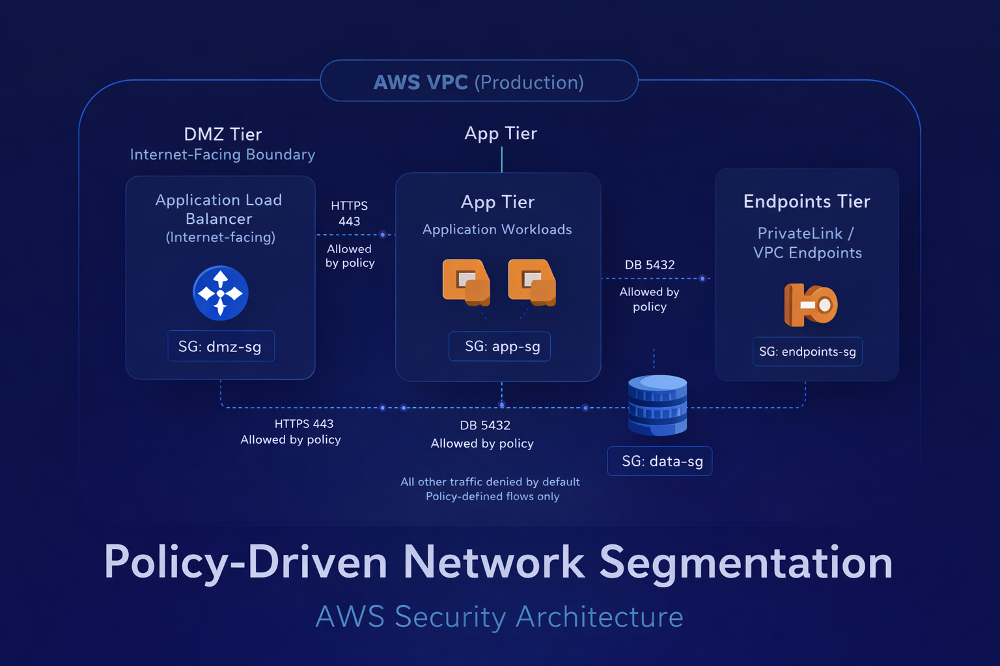
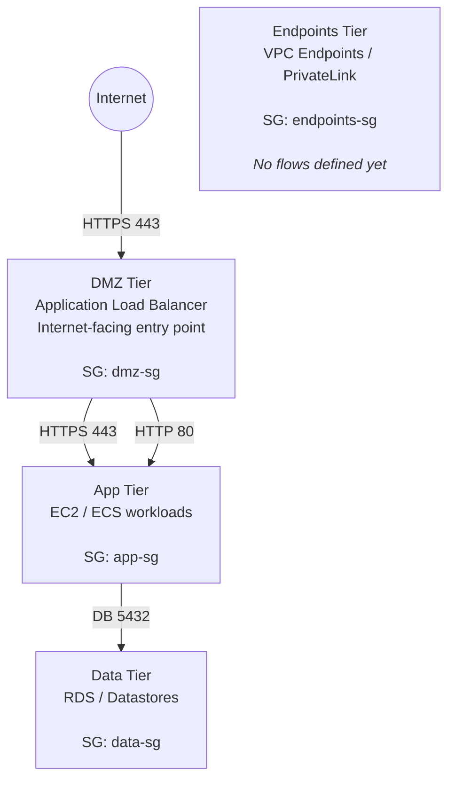
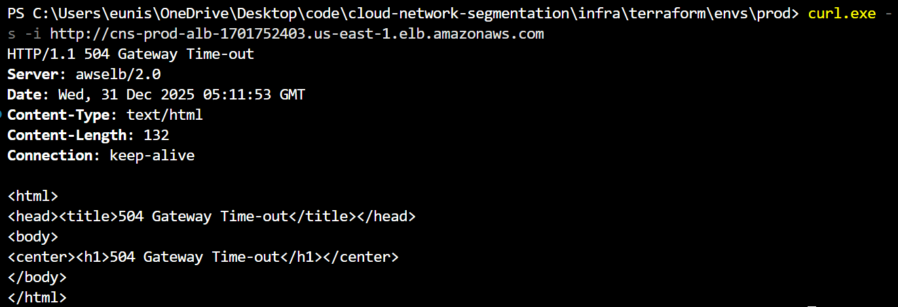
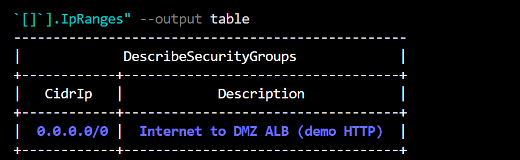

# Cloud Network Segmentation (Policy-Driven AWS Security)


## Overview

This project is designed for cloud security engineers, platform engineers, and security architects who want to enforce network segmentation using policy rather than ad-hoc infrastructure rules.

This repository implements **policy-driven network segmentation in AWS**, using a clear separation between:

- **Security intent** (human-readable policy)
- **Automated validation and translation**
- **Infrastructure enforcement with Terraform**

Rather than hardcoding security group rules directly into Terraform, this project defines **allowed network flows as policy**, validates them against guardrails, and generates Terraform variables automatically. This approach mirrors how mature cloud security and platform teams manage segmentation in regulated and high-risk environments.


---

## Design Goals

- Enforce **deny-by-default** network segmentation  
- Make all allowed traffic **explicit, reviewable, and auditable**  
- Prevent insecure rules from ever reaching Terraform  
- Separate **what is allowed** from **how it is enforced**  
- Support incremental hardening without redesign  

## Non-Goals

This project intentionally does not attempt to:

- Provide intrusion detection or alerting
- Replace WAF, IDS/IPS, or runtime security tooling
- Enforce compliance mappings for specific regulatory frameworks

The focus is strictly on **preventive network segmentation and blast-radius reduction**.

---

## Architecture Summary

The environment is segmented into four logical tiers:

| Tier | Purpose |
|---|---|
| **DMZ** | Internet-facing edge tier (ALB, reverse proxy, WAF integration point) |
| **App** | Application workloads (EC2 / ECS) |
| **Data** | Datastores (RDS, caches) |
| **Endpoints** | VPC endpoints / PrivateLink tier |

Traffic is only allowed between tiers **explicitly defined in policy**.  
All other traffic is **implicitly denied**.

Internet traffic terminates at the **Application Load Balancer (ALB)** in the DMZ.  
The App and Data tiers are never directly exposed to the internet.


## Architecture Diagram (Logical)

**Figure: Policy-Driven Network Segmentation Model**

This diagram illustrates logical network segmentation enforced through explicit,
policy-defined flows. All traffic between tiers is deny-by-default and only
permitted when defined in `segmentation-policy.yaml`. Infrastructure enforcement
is implemented using security group–to–security group rules generated from policy.



*All network traffic is deny-by-default and only permitted when explicitly defined in policy and enforced through security group–to–security group rules.*

**Note**: The Endpoints tier is shown without connections because no policy-approved flows currently exist. Access must be explicitly declared in policy before being permitted.

---

## Policy-Driven Segmentation

### Single Source of Truth

All segmentation intent lives in:

```text
policy/segmentation-policy.yaml
```
This file defines:

- Tiers
- Allowed flows between tiers
- Approved protocols and ports
- Internet access restrictions
- Guardrails that prevent unsafe configurations

### Example (Simplified)

```yaml
flows:
  - name: dmz_to_app_https
    from: dmz
    to: app
    protocol: tcp
    ports: [443]

  - name: dmz_to_app_http
    from: dmz
    to: app
    protocol: tcp
    ports: [80]
    description: "ALB health checks"
```

## Guardrails and Validation

Before any infrastructure is generated, the policy is validated by automation:

- Only approved protocols are allowed
- Only approved ports are allowed
- Internet access is restricted to approved ports
- Direct internet → data access is blocked
- Invalid tiers or malformed rules fail fast

Invalid policies **do not generate Terraform.**

This prevents insecure changes from reaching AWS.


## Automation Flow

```text
segmentation-policy.yaml
        ↓
validate + enforce guardrails
        ↓
generate_sg_rules.py
        ↓
policy.auto.tfvars.json
        ↓
Terraform security group modules
```

The automation **does not create infrastructure**.  
It only generates inputs that Terraform consumes.

> **Note:**  
> The `policy.auto.tfvars.json` file is generated automatically from
> `policy/segmentation-policy.yaml` and is intentionally not committed.
> A sanitized example (`policy.auto.tfvars.json.example`) is provided to
> document the expected structure and policy-to-Terraform interface.


---

## Infrastructure Enforcement

Terraform modules enforce segmentation using:

- One security group per tier  
- Security group-to-security group rules only  
- No CIDR-based east-west rules  
- No implicit allow rules  

Internet ingress is intentionally **not implemented** as SG-to-SG rules.  
It is enforced at the ALB layer (listener + ALB security group).

---

## ALB Health Checks and Security

ALB health checks require explicit allowance from the DMZ tier to the App tier on port **80**.

This rule is:

- Documented in policy  
- Validated by guardrails  
- Automatically generated  
- Enforced as SG-to-SG ingress  

If the policy rule is removed, health checks fail and targets become unhealthy.

## Testing & Validation

This architecture was validated through targeted connectivity and health checks to confirm that **policy-defined flows are correctly enforced** and that all non-approved traffic is denied by default.

After deploying the segmentation controls, Application Load Balancer reachability and target health were tested end-to-end by intentionally observing failure conditions, including unhealthy targets and HTTP 504 responses, when required policy rules were absent. Once the appropriate **DMZ-to-App HTTP allowance** was added to support ALB health checks, the environment recovered as expected.

Final validation confirmed:
- HTTP 200 responses from the Application Load Balancer
- Healthy target group status when policy permits required flows
- Security group rules reflecting only **policy-approved, security group–to–security group access**

These results demonstrate that **network connectivity is a direct outcome of policy changes**, not ad hoc infrastructure configuration.

---

### Connectivity Validation

The following tests confirm that application traffic is reachable **only through the DMZ Application Load Balancer**, as defined by policy.

**ALB → App Tier (Success)**  
An HTTP 200 response confirms an allowed, policy-defined flow.


**Direct Access Bypass Attempt (Failure)**  
Attempting to bypass the ALB results in connection failure, demonstrating deny-by-default enforcement.



---

### Target Group Health Validation

The ALB target group health directly reflects policy enforcement.

- When the **DMZ → App health check flow** is defined in policy, targets remain healthy.
- When the policy rule is removed and Terraform is reapplied, targets immediately transition to unhealthy.

This confirms that **segmentation policy directly controls operational availability**.


---

### Deny-by-Default Enforcement

The App, Data, and Endpoints tiers do not permit any CIDR-based ingress rules.  
All east-west traffic is enforced strictly via **security group–to–security group rules**.

**App Tier – No CIDR Ingress**
```bash
aws ec2 describe-security-groups ...
```
**Data Tier – No CIDR Ingress**

**DMZ Tier – Controlled Public Ingress**

The DMZ tier intentionally permits inbound 0.0.0.0/0 only on HTTPS (443) to the Application Load Balancer.
Noother tiers allow public CIDR access. 



## Repository Structure

```text
.
├── policy/
│   └── segmentation-policy.yaml
│
├── automation/
│   ├── generate_sg_rules.py
│   └── validate_policy.py
│
├── infra/
│   └── terraform/
│       ├── envs/
│       │   └── prod/
│       │       ├── main.tf
│       │       ├── variables.tf
│       │       └── policy.auto.tfvars.json
│       │
│       └── modules/
│           ├── security_groups/
│           ├── alb_dmz/
│           └── network_vpc/
│
├── docs/
│   ├── architecture.md
│   └── evidence/
│       └── validation/
│           ├── alb-connectivity-success.png
│           ├── alb-connectivity-failure.png
│           ├── sg-dmz-public-443-only.png
│           ├── sg-app-no-cidr-ingress.png
│           └── sg-data-no-cidr-ingress.png
│
├── README.md
└── LICENSE
```

## How to Use

### 1. Update segmentation policy

Edit:

```bash
policy/segmentation-policy.yaml
```

### 2. Generate Terraform inputs

Run the policy automation script:

```bash
python automation/generate_sg_rules.py
```

This generates the Terraform variables file:

```bash
infra/terraform/envs/prod/policy.auto.tfvars.json
```

3. Apply infrastructure
```bash
cd infra/terraform/envs/prod
terraform init
terraform apply
```

## Why This Matters

This project demonstrates:

- Real-world cloud segmentation patterns  
- Policy-as-code concepts without vendor lock-in  
- Defensive guardrails that prevent misconfiguration  
- Clear separation of intent versus enforcement  
- Debugging across AWS, Terraform, and Python  
- Practical ALB and security group behavior  

This is the same architectural pattern used in regulated cloud environments,
security-focused platform teams, and large-scale AWS deployments.

---

## Future Enhancements (Planned)

- HTTPS-only backend traffic  
- VPC endpoint-only patching (no internet egress)  
- Policy diff and dry-run mode  
- CI validation of policy changes  
- Multi-environment support (dev / prod parity)  

---

## Security Framework Context (Informational)

This project is informed by established government and industry guidance, without claiming formal compliance.

This segmentation model aligns with Zero Trust principles such as explicit trust boundaries, least privilege network access, and denial of implicit east-west trust, without attempting to implement a full Zero Trust architecture.

### Architectural Alignment

The segmentation model reflects principles described in NSA and CISA cloud security guidance, including:

- Explicit separation of trust zones (DMZ, application, data)
- Deny-by-default network access between tiers
- Reduction of lateral movement through strict workload isolation
- Enforcement of controls at the infrastructure boundary

These references shaped the **design philosophy**, not prescriptive control mappings.

### Threat-Informed Design

From a MITRE ATT&CK perspective, this architecture reduces the impact of:

- Post-compromise lateral movement
- Over-permissive east-west network access
- Implicit trust between application tiers
- Abuse of internal network paths after initial access

ATT&CK is used here to inform **threat modeling and blast-radius reduction**, not to assert coverage or compliance.

**Outcome:**  
A practical, policy-driven segmentation model that improves containment, auditability, and operational clarity in AWS environments.

---
## Author

Nisha McDonnell  
Cloud Security Engineer

Designed and implemented as a policy-driven AWS network segmentation project
to demonstrate secure-by-default architecture, automated guardrails, and
real-world infrastructure enforcement.

## License

This project is licensed under the MIT License.


